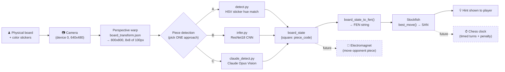
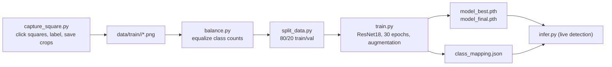

# Chess Coach — Project Architecture Map (מאמן שחמט)

> **Purpose of this document.** A system map of the *code* as it exists today, written to
> be the backbone for the formal project book (עבודת גמר). It shows what the system does,
> how the parts connect, and — important for the book — **what is built vs. what is still
> planned**. Code-level docs are in English; the formal book stays Hebrew.

---

## 1. What the project is

A **physical, AI-assisted chess coach**. A camera looks down on a real wooden board.
Software figures out where every piece is, converts that to a chess position, and can ask a
chess engine for the best move (the "hint" feature). The full product vision also includes an
**electromagnet** under the board that physically moves the opponent's pieces, plus a **chess
clock** with timed turns and hint penalties.

| Layer (book term) | Hebrew | Built today? |
|---|---|---|
| Vision / piece detection (זיהוי כלים) | ראייה ממוחשבת | ✅ Yes — three independent approaches |
| Position → chess logic (FEN) | המרה למצב שחמט | ✅ Yes (in `claude_detect.py`) |
| Best-move hint (Stockfish) (רמז) | מנוע שחמט | ✅ Yes (in `claude_detect.py`) |
| Chess clock / timed turns (טיימר) | שעון שחמט | ❌ Not in code yet |
| Electromagnet piece mover (אלקטרומגנט) | מנגנון הזזה | ❌ Not in code yet (only described in book ch. 2.1) |

This gap is normal for a final project and is itself worth a section in the book
("מה מומש ומה נותר לעתיד").

---

## 2. The big picture (runtime data flow)



ASCII summary:

```
[ Board+stickers ] -> [ Camera ] -> [ Warp 800x800 ] -> [ Detect: sticker | CNN | Claude ]
                                                                  |
                                                          board_state {a1:'wr', ...}
                                                                  |
                                                            FEN  ->  Stockfish  ->  Hint
                                                                  :
                                                          (future) Electromagnet / Clock
```

---

## 3. The three detection approaches (the heart of the project)

All three consume the same warped 800×800 board and output the same `board_state`
dictionary. They are **alternatives** explored during development — a great comparison
chapter for the book.

| | **A. Sticker hue** | **B. CNN (ResNet18)** | **C. Claude Vision** |
|---|---|---|---|
| File | `detect.py` | `infer.py` | `claude_detect.py`, `claude_detect_A.py` |
| Idea | Each piece wears a uniquely-colored sticker; match center hue to a known color | Train a neural net on cropped square images | Send baseline + current photo to Claude Opus; it reasons about the position |
| Needs | `sticker_colors.json` | `model_best.pth` + `class_mapping.json` | `baseline.jpg` + Anthropic API key |
| Method | HSV, median hue in center 28% of square, nearest color within tolerance | 100×100 crops → softmax, per-class confidence thresholds | Vision LLM prompt, returns labels + FEN |
| Speed / cost | Instant, offline, free | Fast, offline, free (after training) | Slower, online, API cost |
| Strength | Simple, robust, no training | Learns appearance, no stickers needed | Most flexible; also gives FEN + hint |
| Weakness | Lighting-sensitive; needs colored stickers | Needs lots of labeled data; here only ~7 imgs/class | Network + cost; non-deterministic |
| Status | Primary current approach | Data-starved (small dataset) | Working incl. hint pipeline |

> **Note for the book:** the approaches are not fully consistent yet — the CNN
> (`class_mapping.json`) only knows **5 classes** (`empty, wb, wn, wp, wr`), while the
> sticker config (`sticker_colors.json`) defines **8 piece colors**. The sticker/Claude
> paths target the full piece set; the CNN is still an early experiment.

### Architecture A vs. plain Claude detector
`claude_detect_A.py` is a speed-optimized variant of `claude_detect.py`: it restructures the
prompt so the static instructions + baseline image form a **cached prefix** (`cache_control`,
1h TTL), lowers reasoning `effort` high→medium, and drops JPEG quality 95→88. Same output,
cheaper/faster repeat calls.

---

## 4. Pipelines (how you actually use it)

### Pipeline 1 — One-time calibration (required by all approaches)
```
calibrate_board.py     click 4 board corners ──► board_transform.json  (perspective matrix M, 800x800)
calibrate_stickers.py  sample each piece's sticker hue ──► sticker_colors.json   (for approach A)
capture_baseline.py    photograph the start position ──► baseline.jpg            (for approach C)
```

### Pipeline 2 — CNN data + training (only for approach B)

Diagnostics around this pipeline: `check.py` (class counts), `diag.py` (per-image
predictions / confusion), `diag2.py` (data-issue checks & fixes), `read.py` (inspect a
checkpoint file).

### Pipeline 3 — Live detection / coaching
```
detect.py           live sticker detection  (terminal board + OpenCV overlay; 'q' quit, 'r' reload colors)
infer.py            live CNN detection
claude_detect.py    --register saves baseline, then detects + can call best_move() for a hint
```

---

## 5. File map (what each file is)

### Live detection (the product)
- **`detect.py`** — Approach A. Real-time sticker-hue detection; prints ANSI board + OpenCV overlay.
- **`infer.py`** — Approach B. Real-time ResNet18 inference with per-class thresholds.
- **`claude_detect.py`** — Approach C. Claude Opus vision detector; FEN conversion + Stockfish hint.
- **`claude_detect_A.py`** — Approach C, speed/cost-optimized (prompt caching).

### Calibration / setup
- **`calibrate_board.py`** — Click 4 corners → perspective matrix → `board_transform.json`.
- **`calibrate_stickers.py`** — Interactive hue sampler → `sticker_colors.json`.
- **`capture_baseline.py`** — Median-stack the start position → `baseline.jpg`.

### CNN dataset & training
- **`capture_square.py`** — Click squares, assign label, save 100×100 crops to `data/train`.
- **`balance.py`** — Trim classes to equal size.
- **`split_data.py`** — Move 20% of each class into `data/val`.
- **`train.py`** — Train ResNet18 (transfer learning, augmentation) → `model_best.pth`.
- **`check.py` / `diag.py` / `diag2.py` / `read.py`** — Diagnostics & checkpoint inspection.

### Config & data artifacts
- **`board_transform.json`** — Perspective matrix `M` + output size (800×800). Used by *all* approaches.
- **`sticker_colors.json`** — Per-piece HSV target (`h`, `s`, `v`, `h_tol`, `s_min`). Used by A.
- **`class_mapping.json`** — CNN class list + index map. Used by B.
- **`baseline.jpg`** — Reference start-position photo. Used by C.
- **`model_best.pth` / `model_final.pth`** — Trained CNN weights (~42 MB each).
- **`reference.png` / `baseline.jpg`** — Reference images.
- **`data/`** (`train/`, `val/`), **`collect/`** (`labeled/`, `unlabeled/`), **`backup_data/`** — image datasets.
- **`requirements.txt`** — `torch, torchvision, opencv-python, numpy, anthropic, chess`.
- **`ProjectBook.docx`** — The formal Hebrew עבודת גמר (this map feeds its software chapters).
- **`TLDR.txt`** — One-line workflow reminder.

---

## 6. Key shared concepts

**Coordinate system / perspective warp.** Every approach starts by applying matrix `M`
(`cv2.warpPerspective`) to flatten the camera view into a top-down 800×800 image, split into
an 8×8 grid of 100×100 cells. Detection samples only the **center ~28–30%** of each cell to
avoid neighbor bleed.

**Board orientation gotcha (note for the book).** The warped image's columns/rows do not map
to files/ranks the obvious way. In `claude_detect.py`: `FILES = "hgfedcba"`, `RANKS =
"12345678"` (image col 0 = h-file, row 0 = rank 1). `detect.py` uses `file = chr('a'+col)`,
`rank = 8-row`. Any future code that drives the electromagnet must agree on this mapping.

**Piece codes.** Two-letter codes throughout: first letter color (`w`/`b`), second letter
piece (`k q r b n p`). e.g. `wr` = white rook, `bn` = black knight. `empty` = no piece.

**Stability trick.** Detectors pool/median several frames (`detect.py`: 6-frame pool;
`claude_detect.py`/`capture_baseline.py`: median of 8) to reduce camera noise.

**Stability/UX note (from project memory).** Never call `input()` inside an OpenCV loop in
this project — it blocks the Qt event thread and kills the window. All interaction goes
through `cv2.waitKey()` key codes.

---

## 7. Gaps & "future work" (good book material)
- **Electromagnet actuation** — described in book ch. 2.1 (Faraday's law / induction) but no
  motor/GPIO/serial code exists yet. Needs: position→move planner + magnet path control.
- **Chess clock / timed turns + 10% hint penalty** — described in the idea (ch. 1.3) but not
  implemented; would sit downstream of `best_move()`.
- **Move detection** — current code reads a *static* position; detecting that a *move
  happened* (diffing consecutive `board_state`s) is the natural next step toward automation.
- **Unify the piece set** — make the CNN cover all 12 piece types like the sticker/Claude paths.

---

## 8. One-paragraph summary (drop-in for the book intro)
> מאמן השחמט הוא לוח שחמט פיזי שמעליו מצלמה. תוכנה מיישרת את תמונת הלוח (טרנספורמציית
> פרספקטיבה), מזהה את הכלים בכל משבצת — בשלוש שיטות חלופיות שנחקרו: התאמת צבע מדבקה (HSV),
> רשת נוירונים (ResNet18), וזיהוי באמצעות מודל הראייה של Claude — וממירה את המצב למחרוזת
> FEN. משם מנוע Stockfish מציע את המהלך הטוב ביותר כ"רמז" לשחקן. בהמשך מתוכננים אלקטרומגנט
> להזזת כלים פיזית ושעון שחמט עם זמני תורות.
